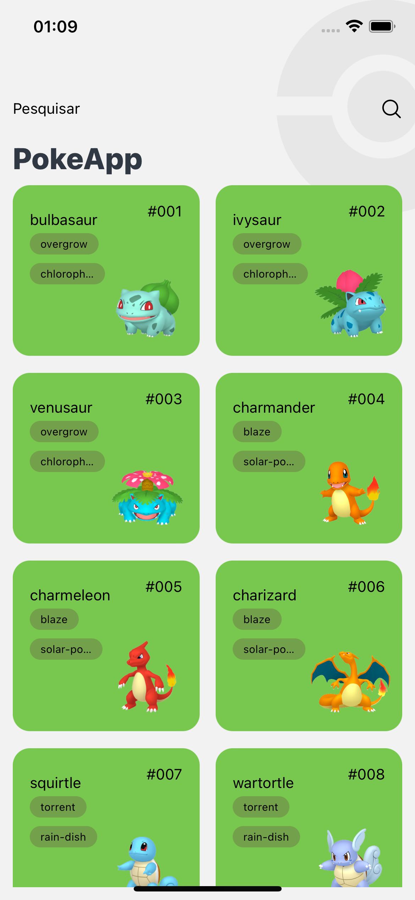
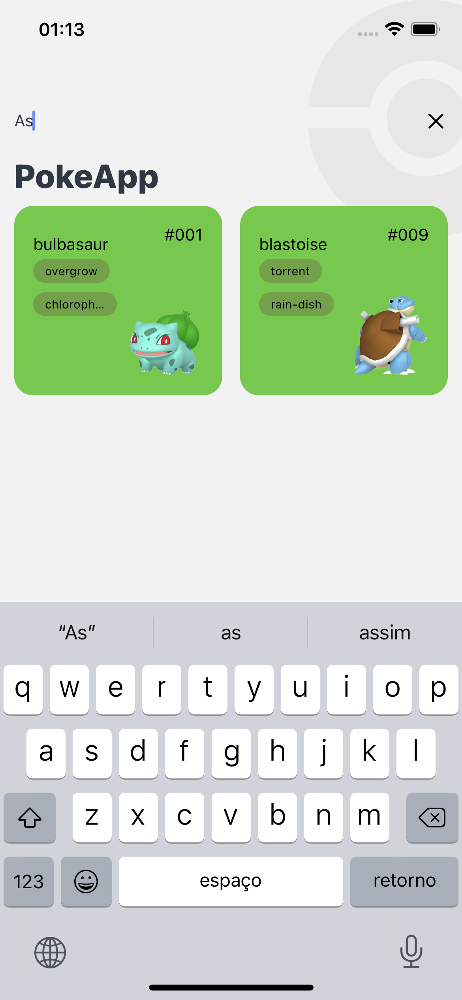
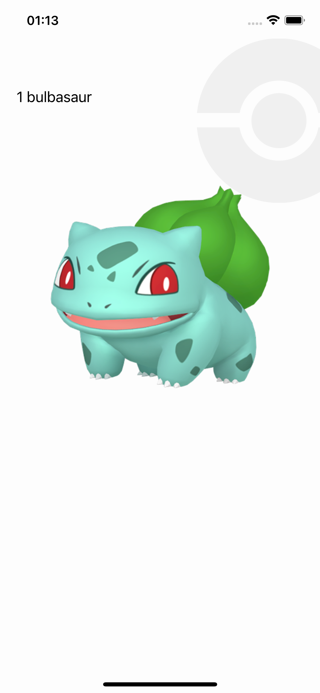

## PokeApp

## About the project

In this project it is consuming the poke Api. We are using React Native, Typescript and Redux.

 Stack
  - React Native
  - Typescript
  - React Navigation 6
  - Redux + Redux Toolkit + Redux Toolkit Query(RTK)
  - Jest
  - React Native Testing Library
  - React Native Testing Library Hooks
  - Mock Service Worker (MSW)
  - React Native Vector Icons
  

##### Obs:

There are scripts in ```package.json``` to build the project in command line, however, this project is only to practice and the commands require some setup, secrets keys, development team for apple and others things else. Then, is necessary to do something else to it work. 

<br/>

<div>
    
    
    
</div>


