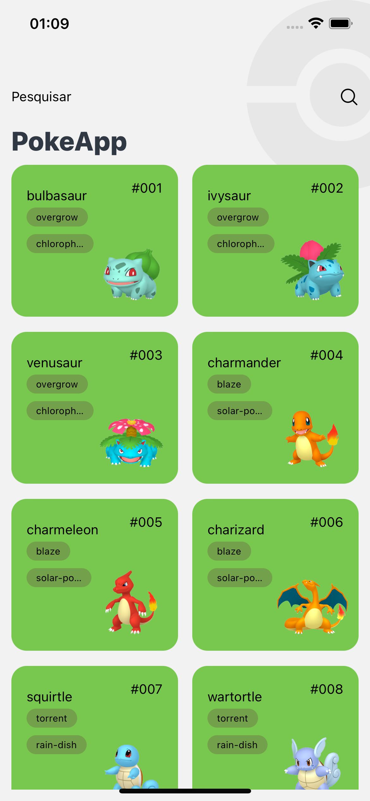

## PokeApp

## About the project

In this project it is consuming the poke Api. We are using React Native, Typescript and Redux.

 Stack
  - React Native
  - Typescript
  - React Navigation 6
  - Redux + Redux Toolkit + Redux Toolkit Query(RTK)
  - Jest
  - React Native Testing Library
  - React Native Testing Library Hooks
  - Mock Service Worker (MSW)
  - React Native Vector Icons
  

 

 

 

